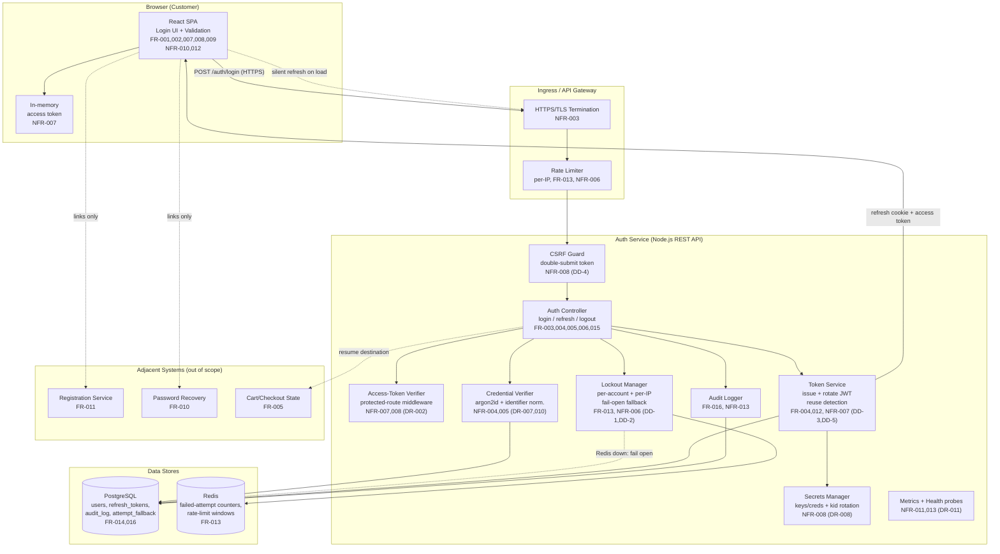
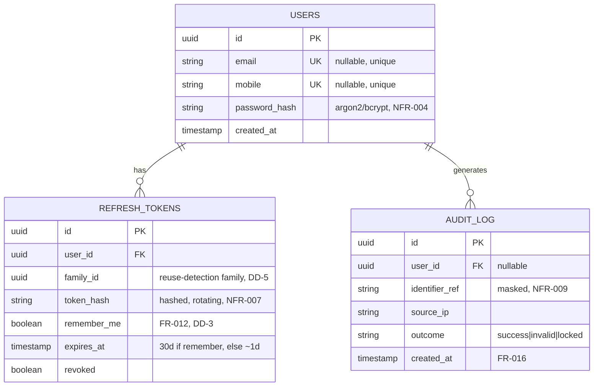

# Architecture — Customer Login for Ecommerce Application

- **Story ID:** US-LOGIN-001
- **Upstream artifact:** [requirements.md](requirements.md)
- **Review:** [design-review.md](design-review.md) — findings DR-001…DR-012, decisions DD-1…DD-5 applied
- **Status:** Reviewed & updated (post design review — Step 3)
- **Scope:** Realizes FR-001…FR-016 and NFR-001…NFR-014 for customer login.

## 1. Architectural Overview

A web application split into a **React SPA frontend** and a stateless
**Node.js REST Auth API**, backed by **PostgreSQL** (durable data) and **Redis**
(lockout counters and rate limiting). Authentication is **self-built** using
adaptive password hashing (argon2id) and JWTs — a short-lived access token
held in browser memory plus a rotating refresh token delivered in an httpOnly,
Secure, SameSite=Strict cookie. Refresh-token rotation includes **reuse
detection with token-family revocation** (DD-5). Protected routes are guarded by
an **access-token verification middleware** (DR-002), and cookie endpoints are
protected with a **double-submit CSRF token** (DD-4). Lockout is enforced
**per-account and per-IP** with a **generic 401** response to avoid account
enumeration (DD-1); if Redis is unavailable the login path **fails open** with a
DB-counter fallback and alerting (DD-2). Secrets (JWT signing keys, DB/Redis
credentials) are held in a **secrets manager** with signing-key rotation via
`kid` (DR-008). Everything is containerized with Docker and deployed to
Kubernetes behind an HTTPS-terminating ingress/API gateway.

### Confirmed Technology Choices

| Layer | Choice | Rationale | Traces to |
| --- | --- | --- | --- |
| Frontend | React + TypeScript (SPA) | Component model + a11y ecosystem; type safety for form/validation logic. | FR-001, FR-002, FR-007–FR-009, NFR-010, NFR-012, NFR-014 |
| Backend | Node.js + Express/Fastify (TypeScript) | Fast REST auth endpoints; shared language with frontend; mature JWT/argon2 libs. | FR-003–FR-006, FR-013–FR-016 |
| Auth | Self-built (argon2id + JWT, rotation + reuse detection) | Full control over token rotation, lockout, and anti-enumeration behavior. | FR-004, FR-013, NFR-004–NFR-008 |
| Durable store | PostgreSQL | Relational integrity for users, refresh tokens, audit log. | FR-014, FR-016, NFR-009 |
| Ephemeral store | Redis | Atomic counters/TTL for lockout + rate limiting. | FR-013, NFR-006 |
| Token transport | Access in memory; refresh in httpOnly Secure SameSite=Strict cookie + double-submit CSRF token | Minimizes XSS token theft and CSRF exposure. | NFR-007, NFR-008 |
| Transport | HTTPS/TLS 1.2+ at ingress | Encrypt all credentials in transit. | NFR-003 |
| Secrets | Secrets manager (Vault/cloud KMS), signing-key rotation via `kid` | No hard-coded/unrotated secrets (OWASP A02). | NFR-008 |
| Deployment | Docker + Kubernetes | Horizontal scale, rolling deploys, availability targets. | NFR-001, NFR-011 |

## 2. Component Diagram



## 3. Data Flow — Login Sequence

```mermaid
sequenceDiagram
    participant U as Customer
    participant S as React SPA
    participant G as Gateway (TLS + RateLimit)
    participant A as Auth API
    participant R as Redis
    participant D as PostgreSQL

    U->>S: Enter identifier + password, click Login
    S->>S: Client-side required-field validation (FR-007, FR-008)
    S->>G: POST /auth/login {identifier, password, rememberMe} (HTTPS, NFR-003)
    G->>G: Per-IP rate-limit check (NFR-006)
    G->>A: Forward request
    A->>A: Normalize identifier (email lc / mobile E.164) (DR-007)
    A->>R: Check per-account AND per-IP lockout (FR-013, DD-1)
    Note over A,R: If Redis down → fail open, alert, DB fallback (DD-2)
    alt Account or IP locked
        A->>D: Audit failed (locked) attempt (FR-016)
        A-->>S: 401 — generic "Invalid email/mobile number or password." (DD-1, NFR-005)
    else Not locked
        A->>D: Look up user by normalized identifier (FR-014)
        A->>A: Verify password hash argon2id, bounded input (NFR-004, DR-010)
        alt Valid credentials
            A->>R: Reset failed-attempt counters (account + IP)
            A->>A: Issue access JWT (15m) + refresh (rememberMe ? 30d rotating : ~1d session) (FR-004, FR-012, DD-3)
            A->>D: Persist refresh token (family id); audit success (FR-016)
            A-->>S: 200 OK + access token (body) + refresh (httpOnly SameSite=Strict cookie) + CSRF token (DD-4)
            S->>S: Store access token in memory; redirect (FR-005, FR-015)
        else Invalid credentials
            A->>R: Increment per-account + per-IP counters (FR-013)
            A->>D: Audit failed attempt (FR-016)
            A-->>S: 401 — "Invalid email/mobile number or password." (FR-006, NFR-005)
        end
    end
```

## 4. Component Responsibilities & Traceability

| Component | Responsibility | Requirements |
| --- | --- | --- |
| React SPA (Login UI) | Render form, client validation, password masking/toggle, error display, Forgot/Register links, redirect handling, silent refresh on load, WCAG AA. | FR-001, FR-002, FR-005, FR-007, FR-008, FR-009, FR-010, FR-011, FR-012, FR-015, NFR-002, NFR-007, NFR-010, NFR-012, NFR-014 |
| Ingress / API Gateway | TLS termination, HTTPS enforcement, per-IP edge rate limiting. | NFR-003, NFR-006 |
| CSRF Guard | Validate double-submit CSRF token on cookie endpoints (refresh/logout). | NFR-007, NFR-008 |
| Access-Token Verifier | Middleware validating access JWT (signature/exp/kid) for protected routes. | NFR-007, NFR-008 |
| Auth Controller | Orchestrate login/refresh/logout endpoints, generic errors, redirect target. | FR-003, FR-005, FR-006, FR-015 |
| Credential Verifier | Normalize identifier, look up user, verify argon2id hash with uniform timing and bounded input. | FR-014, NFR-004, NFR-005 |
| Lockout Manager | Track failed attempts per-account and per-IP; enforce 5-attempt / 15-min lockout via Redis with DB fallback on Redis outage. | FR-013, NFR-006, NFR-011 |
| Token Service | Issue access JWT (15m); rememberMe-aware refresh (30d rotating vs ~1d session); rotation with reuse detection + family revocation. | FR-004, FR-012, NFR-007 |
| Secrets Manager | Provide/rotate JWT signing keys (`kid`) and DB/Redis credentials. | NFR-008 |
| Audit Logger | Record every attempt (success/failure/locked) with PII masking, no secrets. | FR-016, NFR-013, NFR-009 |
| Metrics + Health | Expose readiness/liveness probes and login/lockout metrics + alerts. | NFR-011, NFR-013 |
| PostgreSQL | Durable store: users, refresh_tokens, audit_log, attempt fallback. | FR-014, FR-016, NFR-009 |
| Redis | Ephemeral lockout counters (account + IP) and rate-limit windows with TTL. | FR-013, NFR-006 |
| Kubernetes platform | Horizontal scaling, rolling deploys, availability. | NFR-001, NFR-011 |

## 5. Data Model (Logical)



Lockout counters and rate-limit windows live in **Redis** (keyed by normalized
account **and** source IP with TTL), not in PostgreSQL, to keep hot-path checks
fast (FR-013, NFR-006). A minimal DB-backed `attempt_fallback` counter is used
only when Redis is unavailable (fail-open path, DD-2).

## 6. Integration Points

| Integration | Direction | Nature | Requirements |
| --- | --- | --- | --- |
| Registration service | SPA → external | Link/navigation only (in-scope: link) | FR-011 |
| Password-recovery flow | SPA → external | Link/navigation only (in-scope: link) | FR-010 |
| Cart/checkout state | Auth API/SPA ↔ external | Resume prior destination after login | FR-005 |
| User account store | Auth API → PostgreSQL | Identity lookup (registration is upstream) | FR-014 |

## 7. Cross-Cutting Concerns

- **Security (OWASP Top 10 / NFR-008):** parameterized queries (A03), argon2id
  hashing with bounded input (A02), generic non-enumerating errors + uniform
  timing incl. lockout (A07, NFR-005, DD-1), access-token verification
  middleware on protected routes (A01, DR-002), security headers + CSP,
  SameSite=Strict cookies + double-submit CSRF token (DD-4), secrets in a
  manager with signing-key rotation via `kid` (DR-008), refresh-token reuse
  detection with family revocation (DD-5), identifier normalization (DR-007).
- **Privacy (NFR-009):** minimal PII, masked identifiers in logs, encryption in
  transit and at rest.
- **Performance (NFR-001, NFR-002):** stateless API for horizontal scale, Redis
  for O(1) lockout checks, CDN-served SPA assets.
- **Availability (NFR-011):** multiple API replicas, managed Postgres/Redis with
  failover, readiness/liveness probes; login **fails open** with a DB-counter
  fallback if Redis is unavailable (DD-2).
- **Observability (NFR-013):** structured audit logs, metrics/tracing, and
  health probes; metrics + alerts on failed-login and lockout spikes (DR-011).
- **Accessibility (NFR-010, NFR-012):** semantic form markup, ARIA live regions
  for validation/auth errors, keyboard operability, contrast compliance.

## 8. Key Architecture Decisions

| # | Decision | Rationale | Traces to |
| --- | --- | --- | --- |
| AD-1 | React SPA + Node REST API split | Clear separation; shared TS; scalable stateless API. | FR-001–FR-006 |
| AD-2 | Self-built auth (no managed IdP) | Full control of rotation, lockout, anti-enumeration semantics. | FR-013, NFR-005, NFR-007 |
| AD-3 | PostgreSQL + Redis | Relational integrity for durable data; Redis TTL for hot-path lockout/rate limit. | FR-013, FR-016 |
| AD-4 | Access token in memory, refresh in httpOnly cookie | Reduces XSS token theft and CSRF exposure. | NFR-007, NFR-008 |
| AD-5 | Docker + Kubernetes | Horizontal scale and rolling deploys to meet perf/availability. | NFR-001, NFR-011 |
| AD-6 | Gateway-level TLS + rate limiting | Central enforcement of HTTPS and brute-force mitigation. | NFR-003, NFR-006 |
| AD-7 | Generic 401 on lockout + per-IP lockout (DD-1) | Prevent account enumeration via lockout behavior. | FR-013, NFR-005 |
| AD-8 | Redis fail-open with DB fallback (DD-2) | Preserve availability if lockout store is down. | NFR-006, NFR-011 |
| AD-9 | rememberMe-aware refresh lifetime (DD-3) | Honor user's persistence choice (30d vs ~1d). | FR-012, NFR-007 |
| AD-10 | SameSite=Strict + double-submit CSRF token (DD-4) | Defend cookie endpoints against CSRF. | NFR-007, NFR-008 |
| AD-11 | Refresh reuse detection + family revocation (DD-5) | Detect and contain stolen refresh tokens. | NFR-007 |
| AD-12 | Access-token verification middleware (DR-002) | Enforce access control on protected routes. | NFR-007, NFR-008 |
| AD-13 | Secrets manager + `kid` key rotation (DR-008) | Avoid hard-coded/unrotated secrets. | NFR-008 |

## 9. Pipeline Automation — Copilot Capabilities

How this repository's Agentic SDLC pipeline drives the work that produces and
evolves this architecture:

| Capability | Artifact / Location | Role for this step |
| --- | --- | --- |
| **Agents** | `.github/agents/*.agent.md` | The **Architect Agent** owns Step 2 and produced this file; it hands off to the **Design Review Agent** (Step 3). |
| **Prompts** | `.github/prompts/02-architecture.prompt.md` | `/02-architecture` slash-command that runs this step; `/03-design-review` is the next entry point. |
| **Instructions** | `.github/copilot-instructions.md`, `.github/instructions/sdlc-artifacts.instructions.md`, `code-quality.instructions.md` | Always-on + path-scoped standards: ID-based traceability, testable language, `Not Found` over invention, OWASP-secure code. |
| **Skills** | `.github/skills/sdlc-traceability/SKILL.md`, `read-user-story/SKILL.md` | `sdlc-traceability` keeps every component tied to an `FR`/`NFR`; `read-user-story` fed Step 1. |
| **Hooks** | `.github/copilot/hooks.json` + `.github/copilot/hooks/*` | Lifecycle gates: secret scanning and artifact-ordering (block Step 2 if `requirements.md` is missing). |

## 10. Assumptions & Open Questions

**Assumptions**
- Registration and password-recovery services exist and are reachable via links.
- A managed/HA PostgreSQL and Redis are available in the target cloud.
- The API gateway/ingress provides TLS termination and rate limiting.
- Single combined identifier field (per requirements OQ-01 assumption).

**Open questions carried forward (from requirements)**
- OQ-01: single vs. dual identifier field — assumed single (affects SPA + API).
- OQ-02: mobile-number format standard (E.164?) for validation.
- OQ-03: audit-log retention period for PostgreSQL storage sizing.
- OQ-04: whether the React + Node stack is finally mandated (now confirmed here).
- OQ-05: notify account owner on repeated failures (would add an integration).

---

### Traceability

Every component in §4 and every decision in §8 cites the `FR`/`NFR` it realizes.
No new requirements were invented; design-review findings (DR-001…DR-012) and
decisions (DD-1…DD-5) from [design-review.md](design-review.md) are reflected
above; remaining gaps are recorded as open questions per the
`sdlc-traceability` skill.

**Next step:** hand off to `/04-impl-plan` (Planner Agent).
