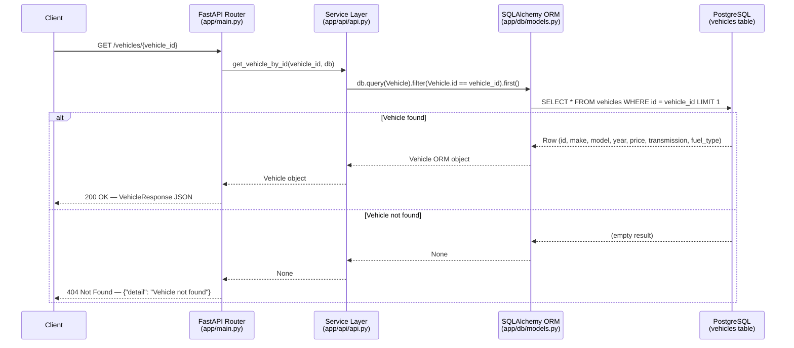

# Architecture — Car Portal: Get Vehicle Details

**Requirements Source:** `artifacts/requirements.md`
**Generated By:** Agentic SDLC Pipeline — Architect Agent
**Date:** 2026-09-24
**Status:** Draft — Pending Review

---

## 1. Architecture Overview

The Car Portal application is an existing Python FastAPI service. This document covers the minimal scope required to satisfy **FR-001, FR-002, FR-003**: exposing a `GET /vehicles/{vehicle_id}` endpoint that retrieves a vehicle record from PostgreSQL via SQLAlchemy ORM and returns it as JSON.

The following components already exist in the codebase and are reused as-is:
- `app/main.py` — FastAPI application with route definitions
- `app/api/api.py` — service/handler functions
- `app/db/models.py` — SQLAlchemy `Vehicle` model and Pydantic `VehicleResponse`
- `app/db/database.py` — DB engine, session factory, `get_db` dependency

The endpoint `GET /vehicles/{vehicle_id}` is already implemented. This architecture document formalises its design for downstream planning, review, and verification.

---

## 2. Architectural Goals and Drivers

| Driver | Requirement |
|--------|-------------|
| Expose an HTTP endpoint accepting a vehicle ID | FR-001 |
| Return all 6 vehicle attributes: make, model, year, price, transmission, fuel_type | FR-002 |
| Return HTTP 404 when the vehicle ID is not found | FR-003 |
| Respond with `Content-Type: application/json` | NFR-001 |
| Use HTTP 200 on success, HTTP 404 on not-found | NFR-002 |
| Python 3.8+, FastAPI, PostgreSQL, SQLAlchemy | Technical stack constraint |

---

## 3. Recommended Architecture

**Pattern:** Layered monolith — Router → Service layer → ORM → Database

This is the simplest architecture that satisfies all requirements without introducing unnecessary complexity. The existing application already follows this pattern; the vehicle endpoint integrates naturally.

```
Client HTTP Request
       │
       ▼
  FastAPI Router (app/main.py)
       │  path param: vehicle_id: int
       ▼
  Service Layer (app/api/api.py)
       │  get_vehicle_by_id(vehicle_id, db)
       ▼
  SQLAlchemy ORM (app/db/models.py — Vehicle)
       │  db.query(Vehicle).filter(Vehicle.id == vehicle_id).first()
       ▼
  PostgreSQL Database (vehicles table)
       │
       ▼
  VehicleResponse (Pydantic model — serialised to JSON)
       │
       ▼
  HTTP Response (200 / 404)
```

---

## 4. Component Diagram

```mermaid
flowchart TD
    Client([HTTP Client]) -->|GET /vehicles/{vehicle_id}| Router

    subgraph FastAPI App
        Router[Router\napp/main.py\nGET /vehicles/{vehicle_id}]
        Service[Service Layer\napp/api/api.py\nget_vehicle_by_id]
        Model[SQLAlchemy Model\napp/db/models.py\nVehicle]
        Response[Pydantic Schema\nVehicleResponse]
        DB_Dep[DB Dependency\napp/db/database.py\nget_db]
    end

    PostgreSQL[(PostgreSQL\nvehicles table)]

    Router -->|vehicle_id, db session| Service
    Router -->|injects| DB_Dep
    DB_Dep -->|Session| Service
    Service -->|ORM query| Model
    Model -->|SQL query| PostgreSQL
    PostgreSQL -->|Vehicle row| Model
    Model -->|Vehicle object| Service
    Service -->|Vehicle object or None| Router
    Router -->|serialise| Response
    Response -->|JSON 200| Client
    Router -->|None → raise| HTTPException([HTTPException 404])
    HTTPException -->|JSON 404| Client
```

---

## 5. Key Components and Responsibilities

| Component | File | Responsibility | Traces To |
|-----------|------|----------------|-----------|
| **FastAPI Router** | `app/main.py` | Declares `GET /vehicles/{vehicle_id}`, injects DB session, raises `HTTPException(404)` when vehicle is `None` | FR-001, FR-003, NFR-001, NFR-002 |
| **Service Layer** | `app/api/api.py` | `get_vehicle_by_id(vehicle_id, db)` — queries ORM, returns `Vehicle` ORM object or `None` | FR-001 |
| **SQLAlchemy Model** | `app/db/models.py` — `Vehicle` | Maps `vehicles` table; columns: `id`, `make`, `model`, `year`, `price`, `transmission`, `fuel_type` | FR-001, FR-002 |
| **Pydantic Response Schema** | `app/db/models.py` — `VehicleResponse` | Serialises ORM object to JSON with exactly the 6 required fields; `from_attributes=True` | FR-002, NFR-001 |
| **DB Session Factory** | `app/db/database.py` | Creates/closes SQLAlchemy sessions; provides `get_db` FastAPI dependency | FR-001 |
| **PostgreSQL Database** | External (env `DATABASE_URL`) | Stores vehicle records in `vehicles` table | FR-001, FR-002 |

---

## 6. Data Flow



---

## 7. Technology Choices and Rationale

| Technology | Choice | Rationale |
|------------|--------|-----------|
| **Web framework** | FastAPI | Mandated by technical stack; provides automatic JSON serialisation (NFR-001), OpenAPI docs, and Pydantic integration |
| **Database** | PostgreSQL | Mandated by technical stack; production-grade relational store |
| **ORM** | SQLAlchemy | Mandated by technical stack; `Session.query` provides the `.first()` pattern needed for FR-001/FR-003 |
| **Validation/serialisation** | Pydantic v2 (`VehicleResponse`) | Already in use; `response_model=VehicleResponse` on the route ensures correct field set (FR-002) and JSON content-type (NFR-001) |
| **DB URL fallback** | SQLite (dev/test) | `DATABASE_URL` env var defaults to `sqlite:///./carportal.db`; allows local testing without PostgreSQL |

---

## 8. Database Schema

**Table:** `vehicles`

| Column | Type | Constraints | Maps To |
|--------|------|-------------|---------|
| `id` | INTEGER | PRIMARY KEY, INDEX | path param `vehicle_id` |
| `make` | VARCHAR(100) | NOT NULL | FR-002 |
| `model` | VARCHAR(100) | NOT NULL | FR-002 |
| `year` | INTEGER | NOT NULL | FR-002 |
| `price` | NUMERIC(12,2) | NOT NULL | FR-002 |
| `transmission` | VARCHAR(50) | NOT NULL | FR-002 |
| `fuel_type` | VARCHAR(50) | NOT NULL | FR-002 |

---

## 9. HTTP Contract

| Attribute | Value | Traces To |
|-----------|-------|-----------|
| **Method** | `GET` | FR-001 |
| **Path** | `/vehicles/{vehicle_id}` | FR-001 |
| **Path parameter** | `vehicle_id: int` | FR-001 |
| **Success status** | `200 OK` | NFR-002 |
| **Success body** | `{"make": str, "model": str, "year": int, "price": float, "transmission": str, "fuel_type": str}` | FR-002 |
| **Not-found status** | `404 Not Found` | FR-003, NFR-002 |
| **Not-found body** | `{"detail": "Vehicle not found"}` | FR-003 |
| **Validation-error status** | `422 Unprocessable Entity` | FR-001, NFR-002 |
| **Validation-error body** | `{"detail": [...]}` (FastAPI validation error format) — triggered when `vehicle_id` is not a valid integer | FR-001 |
| **Content-Type** | `application/json` | NFR-001 |

> **Note (DR-002):** `price` is stored as `NUMERIC(12,2)` in PostgreSQL; SQLAlchemy returns a `Decimal` object. Pydantic coerces `Decimal → float` at the `VehicleResponse` serialisation boundary. Floating-point precision loss is accepted for MVP car-price values.

---

## 10. Security, Observability, Deployment

**Security:**
- No authentication or authorisation in scope (explicitly out of scope per `artifacts/requirements.md`)
- `vehicle_id` is typed as `int` by FastAPI; non-integer path params return HTTP 422 automatically (no SQL injection surface via ORM parameterised queries)

**Observability:**
- FastAPI logs requests to stdout by default; no additional instrumentation in scope
- Uvicorn access logs capture method, path, and status code

**Deployment:**
- `DATABASE_URL` environment variable controls the database connection string
- SQLite fallback enables local development and CI testing without PostgreSQL
- Application runs via `uvicorn app.main:app`

---

## 11. Assumptions, Constraints, Risks

| Type | Detail |
|------|--------|
| **Assumption** | The `vehicles` table and its schema already exist in the target database |
| **Assumption** | `vehicle_id` in the path corresponds to the `id` primary key column |
| **Constraint** | All 6 response fields are non-nullable in the DB schema; no partial-data handling needed |
| **Risk** | If `DATABASE_URL` is not set in production, the app falls back to SQLite silently; operators must set the env var explicitly |
| **Risk** | `price` is stored as `NUMERIC(12,2)` but serialised as `float` — floating-point precision loss possible for large values; acceptable for MVP |

---

## 12. Out of Scope

Matches `artifacts/requirements.md`:

- Vehicle search or filtering by attributes
- Vehicle creation, update, or deletion
- User authentication or authorisation
- Pagination or list endpoints
- Performance SLAs, scalability, or availability requirements
- Integration with external data providers
- Recommendation engine logic
