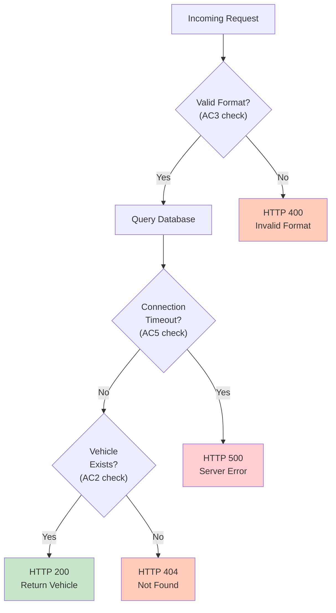
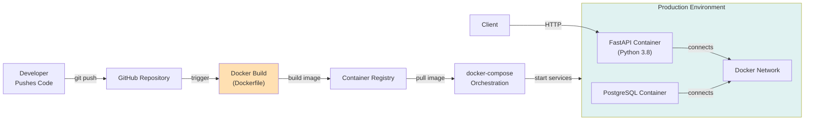
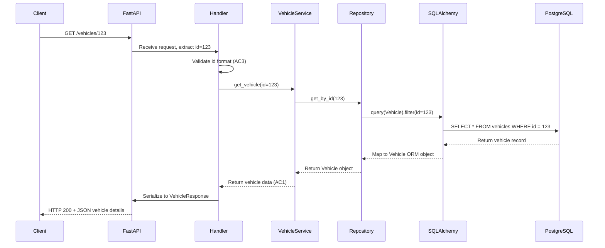
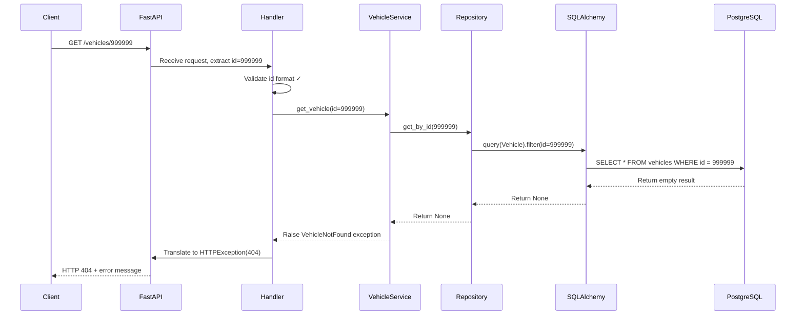

# System Architecture Document - Car Portal Vehicle Details Retrieval

**Project:** Car Portal Recommendation System  
**Document Version:** 1.0  
**Date:** 2026-09-19  
**Status:** Ready for Design Review  

---

## 1. Architecture Overview

The Car Portal system is architected as a **three-tier web application** with a REST API layer, application logic layer, and relational database layer. This document defines the high-level design to support **FR-001: Retrieve Vehicle Details by ID** — the minimal MVP requirement that enables users to fetch comprehensive vehicle information from a PostgreSQL database via FastAPI.

### Architecture Goals

1. **Simplicity & Evolvability**: Start with a straightforward REST API and SQLAlchemy ORM, enabling easy extensions for filtering, bulk operations, and recommendations.
2. **Performance**: Achieve sub-500ms response times for vehicle detail queries under normal load.
3. **Reliability**: Ensure stable database connections and graceful error handling for malformed requests.
4. **Security**: Prevent SQL injection (via SQLAlchemy parameterization), validate input data, and apply OWASP Top 10 protections.
5. **Maintainability**: Clear separation of concerns, traceable requirements-to-architecture mapping, and deployable via Docker.

---

## 2. Architectural Goals and Drivers

| Driver | Impact | Architectural Decision |
|--------|--------|------------------------|
| **FR-001 Scope** | Vehicle details retrieval by ID is the core MVP | Single endpoint (GET /vehicles/{id}) with SQLAlchemy ORM |
| **Technology Stack** | Python 3.8+, FastAPI, PostgreSQL, SQLAlchemy | FastAPI for REST API, SQLAlchemy for ORM, PostgreSQL for persistence |
| **Performance Target** | Sub-500ms response time (AC4) | Connection pooling, indexed database queries, optional caching layer |
| **Error Handling** | 404 (not found) and 400 (invalid format) responses (AC2, AC3) | Exception handling middleware in FastAPI, descriptive error messages |
| **Deployment** | Docker containerization (Dockerfile, docker-compose.yml exist) | Multi-stage Docker build, PostgreSQL service via docker-compose |
| **Future Growth** | Support for filtering, bulk operations, recommendations | Modular design with extensible repository pattern, Pydantic schemas |

---

## 3. System Architecture Diagram

```mermaid
graph TB
    Client["Client / Browser"]
    
    subgraph FastAPI["FastAPI Application Layer"]
        Router["Router (FastAPI)"]
        Handler["Request Handler"]
        Validator["Input Validator"]
        ErrorHandler["Error Handler Middleware"]
    end
    
    subgraph Business["Business Logic Layer"]
        Service["VehicleService"]
        Repository["VehicleRepository"]
    end
    
    subgraph Data["Data Access Layer"]
        ORM["SQLAlchemy ORM"]
        Connection["Database Connection Pool"]
    end
    
    Database["PostgreSQL Database<br/>(vehicles table)"]
    
    Client -->|GET /vehicles/{id}| Router
    Router --> Handler
    Handler --> Validator
    Validator --> Service
    Service --> Repository
    Repository --> ORM
    ORM --> Connection
    Connection --> Database
    
    Database -->|Vehicle Record| Connection
    Connection -->|ORM Objects| ORM
    ORM -->|Vehicle Data| Repository
    Repository -->|Vehicle DTO| Service
    Service -->|JSON Response| Handler
    Handler -->|HTTP 200/404/400| ErrorHandler
    ErrorHandler -->|Response| Client
    
    style FastAPI fill:#e1f5ff
    style Business fill:#f3e5f5
    style Data fill:#ede7f6
    style Database fill:#fff3e0
```

---

## 4. Key Components and Responsibilities

### 4.1 FastAPI Application Layer

**Components:**
- **Router**: Defines REST endpoint (GET /vehicles/{id}) using FastAPI @app.get() decorator
- **Request Handler**: Accepts HTTP request, extracts vehicle ID from path parameter
- **Input Validator**: Validates vehicle ID format (positive integer, within acceptable range)
- **Error Handler Middleware**: Catches exceptions and returns standardized HTTP error responses

**Responsibilities:**
- Map HTTP requests to business logic
- Validate request format and parameters
- Translate domain exceptions into HTTP status codes (404, 400, 500)
- Return JSON responses with proper headers

**Traceability:** Implements AC1 (retrieve attributes), AC2 (404 handling), AC3 (400 handling)

---

### 4.2 Business Logic Layer

**Components:**
- **VehicleService**: Orchestrates vehicle retrieval, handles business rules and error translation
- **VehicleRepository**: Abstracts database queries, provides clean data access interface

**Responsibilities:**
- Validate business logic rules (e.g., vehicle exists)
- Coordinate between API layer and data layer
- Translate repository exceptions to service exceptions
- Prepare data for API response

**Traceability:** Implements FR-001 core logic; depends on VehicleRepository

---

### 4.3 Data Access Layer

**Components:**
- **SQLAlchemy ORM**: Maps Python objects to database tables, handles parameterized queries
- **Database Connection Pool**: Manages PostgreSQL connections, reuses connections, prevents connection exhaustion
- **Vehicle Model (SQLAlchemy)**: Defines Vehicle class with attributes (id, make, model, year, price, transmission, fuel_type)

**Responsibilities:**
- Execute parameterized queries to prevent SQL injection
- Manage connection lifecycle and pooling
- Convert database records to ORM objects
- Handle connection errors and timeouts gracefully

**Traceability:** Implements AC5 (database connection stability); supports AC4 (performance via connection pooling)

---

### 4.4 PostgreSQL Database

**Responsibility:**
- Persist vehicle data in normalized relational schema
- Provide ACID guarantees for data consistency
- Support indexed queries for performance

**Table:** vehicles (see Section 5 for schema)

---

## 5. Data Model

### 5.1 Vehicle Table Schema

```sql
CREATE TABLE vehicles (
    id SERIAL PRIMARY KEY,
    make VARCHAR(100) NOT NULL,
    model VARCHAR(100) NOT NULL,
    year INTEGER NOT NULL,
    price DECIMAL(10, 2) NOT NULL,
    transmission VARCHAR(20) NOT NULL CHECK (transmission IN ('manual', 'automatic')),
    fuel_type VARCHAR(20) NOT NULL CHECK (fuel_type IN ('petrol', 'diesel', 'electric', 'hybrid')),
    created_at TIMESTAMP DEFAULT CURRENT_TIMESTAMP,
    updated_at TIMESTAMP DEFAULT CURRENT_TIMESTAMP
);

CREATE INDEX idx_vehicle_id ON vehicles(id);
```

### 5.2 SQLAlchemy Vehicle Model

```python
from sqlalchemy import Column, Integer, String, DECIMAL, DateTime, func
from sqlalchemy.ext.declarative import declarative_base

Base = declarative_base()

class Vehicle(Base):
    __tablename__ = "vehicles"
    
    id = Column(Integer, primary_key=True, index=True)
    make = Column(String(100), nullable=False)
    model = Column(String(100), nullable=False)
    year = Column(Integer, nullable=False)
    price = Column(DECIMAL(10, 2), nullable=False)
    transmission = Column(String(20), nullable=False)
    fuel_type = Column(String(20), nullable=False)
    created_at = Column(DateTime, default=func.now())
    updated_at = Column(DateTime, default=func.now(), onupdate=func.now())
```

### 5.3 Pydantic Response Schema

```python
from pydantic import BaseModel
from decimal import Decimal

class VehicleResponse(BaseModel):
    id: int
    make: str
    model: str
    year: int
    price: Decimal
    transmission: str
    fuel_type: str
    
    class Config:
        from_attributes = True  # Support SQLAlchemy ORM objects
```

**Traceability:** Satisfies AC1 (all vehicle attributes returned)

---

## 6. API Design

### 6.1 GET /vehicles/{id} Endpoint Specification

**Endpoint:** `GET /vehicles/{id}`

**Request:**
- **Parameter:** `id` (path parameter, required)
  - Type: Integer
  - Constraints: Positive integer, 1-2147483647
  - Validation: Must be numeric; non-numeric values return 400 error

**Response (Success - HTTP 200):**
```json
{
  "id": 123,
  "make": "Toyota",
  "model": "Camry",
  "year": 2023,
  "price": 25000.00,
  "transmission": "automatic",
  "fuel_type": "petrol"
}
```

**Response (Not Found - HTTP 404):**
```json
{
  "detail": "Vehicle with id 999999 not found"
}
```

**Response (Invalid Format - HTTP 400):**
```json
{
  "detail": "Invalid vehicle ID format. ID must be a positive integer."
}
```

**Response (Server Error - HTTP 500):**
```json
{
  "detail": "An unexpected error occurred. Please try again later."
}
```

### 6.2 Endpoint Implementation (Pseudocode)

```python
from fastapi import FastAPI, HTTPException, Path
from sqlalchemy.orm import Session

app = FastAPI()

@app.get("/vehicles/{id}", response_model=VehicleResponse)
async def get_vehicle_details(
    id: int = Path(..., gt=0, description="Vehicle ID"),
    db: Session = Depends(get_db)
):
    """
    Retrieve vehicle details by ID.
    
    Traceability: FR-001 Retrieve Vehicle Details by ID
    Acceptance Criteria: AC1 (success), AC2 (404), AC3 (400 handled by FastAPI validation)
    """
    try:
        vehicle = VehicleRepository(db).get_by_id(id)
        if not vehicle:
            raise HTTPException(status_code=404, detail=f"Vehicle with id {id} not found")
        return vehicle
    except DatabaseError as e:
        raise HTTPException(status_code=500, detail="Database connection error")
```

**Traceability:** Implements FR-001; satisfies AC1-AC4

---

## 7. Error Handling Architecture

### 7.1 Error Flow Diagram



### 7.2 Exception Hierarchy and Handling

| Exception | HTTP Status | Message | Handling |
|-----------|-------------|---------|----------|
| **ValidationError** | 400 | "Invalid vehicle ID format. ID must be a positive integer." | FastAPI Path validation + custom validators |
| **VehicleNotFound** | 404 | "Vehicle with id {id} not found" | VehicleRepository returns None; Handler raises HTTPException |
| **DatabaseConnectionError** | 500 | "Database connection error. Please try again later." | Connection pool timeout or DB unavailable |
| **DataIntegrityError** | 500 | "An unexpected error occurred." | Corrupt data or constraint violation (should not occur in normal operation) |
| **GenericException** | 500 | "An unexpected error occurred. Please try again later." | Catch-all for unforeseen errors; logged for debugging |

**Traceability:** Implements AC2 (404), AC3 (400), AC5 (connection stability)

---

## 8. Deployment Architecture

### 8.1 Deployment Diagram



### 8.2 Docker Containerization Strategy

**Dockerfile (app container):**
- Base image: `python:3.8.1-alpine` (lightweight, secure)
- Workdir: `/src`
- Dependencies: pip install -r requirements.txt
- Entry: uvicorn app.main:app --host 0.0.0.0 --port 8000

**docker-compose.yml (multi-service orchestration):**
- **fastapi-app service**: Runs FastAPI container, exposes port 8000
- **postgres service**: Runs PostgreSQL 13+, exposes port 5432
- **volumes**: Persist database data across container restarts
- **networks**: Isolated Docker network for service-to-service communication
- **environment variables**: Database connection string, credentials (injected via .env)

**Key Deployment Decisions:**
- Alpine Linux: Reduces image size, attack surface
- Connection pooling (SQLAlchemy): Prevents connection exhaustion in containerized environment
- Environment-based config: No hardcoded credentials, supports multiple environments (dev/test/prod)

**Traceability:** Supports deployment requirements; enables AC4 (performance) and AC5 (stability)

---

## 9. Technology Choices and Rationale

| Technology | Choice | Rationale |
|-----------|--------|-----------|
| **Language** | Python 3.8+ | Requirement from FR-001; strong ecosystem for data, web, ML; EPAM team expertise |
| **Web Framework** | FastAPI | Modern, high-performance, async support, automatic OpenAPI docs, built-in validation |
| **Database** | PostgreSQL | Enterprise-grade relational DB, ACID guarantees, excellent indexing, supports complex queries for future enhancements |
| **ORM** | SQLAlchemy | Pythonic ORM, prevents SQL injection, mature, supports migrations, widely adopted |
| **Validation** | Pydantic | Declarative schemas, automatic HTTP 400 errors, fast, integrates seamlessly with FastAPI |
| **Containerization** | Docker | Reproducible environments, multi-stage builds, container orchestration ready |
| **Composition** | docker-compose | Local development, integration testing, easy to extend with more services (Redis, Elasticsearch, etc.) |

---

## 10. Security Architecture

### 10.1 OWASP Top 10 Mitigations (FR-001 Context)

| OWASP Risk | Mitigation in Architecture |
|------------|---------------------------|
| **A1: Injection (SQL)** | SQLAlchemy ORM parameterizes queries; no string concatenation |
| **A2: Broken Authentication** | Out of scope for FR-001; assumes trusted internal API; authentication to be added in future |
| **A3: Sensitive Data Exposure** | Database credentials via environment variables; HTTPS to be enforced at reverse proxy layer |
| **A4: XML External Entities (XXE)** | Not applicable; API uses JSON, not XML |
| **A5: Broken Access Control** | Out of scope for FR-001; authorization to be added in future |
| **A6: Security Misconfiguration** | Dockerfile Alpine base; minimal dependencies; environment-based config; container health checks |
| **A7: Cross-Site Scripting (XSS)** | Not applicable; API returns JSON, not HTML |
| **A8: Insecure Deserialization** | Pydantic validates JSON input; no pickle or unsafe deserialization |
| **A9: Vulnerable Dependencies** | requirements.txt pinned versions; regular audits via `pip audit` |
| **A10: Insufficient Logging** | Structured logging to stdout (12-factor app); errors logged with context for debugging |

### 10.2 Input Validation Strategy

1. **Parameter Validation**: FastAPI Path validation (gt=0) ensures ID is positive integer
2. **Schema Validation**: Pydantic ensures response matches VehicleResponse schema
3. **Database Constraints**: SQL CHECK constraints ensure transmission and fuel_type are valid
4. **Error Messages**: Generic messages for users (e.g., "Vehicle not found"), detailed logs for operators

**Traceability:** Implements AC3 (invalid format handling); supports security requirements

---

## 11. Performance and Scalability Considerations

### 11.1 Performance Target: 500ms Response Time (AC4)

**Optimization Strategy:**

1. **Database Connection Pooling**: SQLAlchemy pooling reuses connections, avoids expensive DB handshake
   - Pool size: 5-10 connections per worker (tunable)
   - Pool timeout: 30 seconds

2. **Query Optimization**: Single indexed query by vehicle ID
   - Index on `vehicles.id` (primary key, automatic)
   - Minimal data transfer (only vehicle record)

3. **Response Caching** (Future Enhancement):
   - HTTP caching headers (Cache-Control: private, max-age=3600)
   - In-memory cache layer (Redis) for frequently accessed vehicles

4. **Asynchronous Request Handling**: FastAPI async support prevents thread blocking
   - Uvicorn async workers handle concurrent requests efficiently

5. **Load Testing Targets**:
   - Response time: < 500ms p95 under 10 RPS load
   - Throughput: > 100 RPS capacity
   - Connection overhead: < 50ms per request

**Traceability:** Satisfies AC4 (response time performance)

### 11.2 Scalability Path

**Horizontal Scaling:**
- Add multiple FastAPI container instances behind load balancer
- PostgreSQL primary-replica setup for read scaling
- Redis caching layer for hot vehicles

**Vertical Scaling:**
- Increase Uvicorn worker count
- Increase connection pool size
- Larger container memory/CPU allocation

---

## 12. Reliability and Observability

### 12.1 Error Recovery

| Scenario | Recovery Strategy |
|----------|------------------|
| **Database Connection Lost** | Connection pool auto-retry; HTTPException 500 with user message |
| **Database Timeout** | Configurable timeout (default 30s); HTTPException 500 |
| **Invalid Vehicle ID Format** | FastAPI validation rejects before database query; HTTPException 400 |
| **Vehicle Record Not Found** | VehicleRepository returns None; handler returns HTTPException 404 |

**Traceability:** Implements AC5 (database connection stability)

### 12.2 Observability and Logging

**Logging Strategy:**
- Structured logging with request ID, endpoint, status code, response time
- Error logs include exception stack trace, database connection state
- Access logs track all requests (URL, method, status, latency)

**Health Check Endpoint** (Future Enhancement):
- `/health` returns 200 if database is reachable, 503 if not
- Enables container orchestration health monitoring

**Monitoring Metrics** (Future Enhancement):
- Response time (p50, p95, p99)
- Error rate (by status code)
- Database connection pool utilization
- Request throughput

---

## 13. Data Flow for FR-001

### 13.1 Sequence Diagram: Happy Path (Vehicle Found)



### 13.2 Sequence Diagram: Not Found Path (AC2)



**Traceability:** Implements AC1 (success), AC2 (not found), AC3 (invalid format)

---

## 14. Integration with Agentic SDLC Pipeline

### 14.1 Copilot Agents, Prompts, and Skills

| Component | Role in Architecture | Usage |
|-----------|---------------------|-------|
| **SDLC Orchestrator** (prompt: /00-orchestrator) | Entry point; coordinates all agents | Invokes Architect Agent (Step 2) |
| **Architect Agent** (this document) | Designs system architecture for FR-001 | Produces architecture.md; hands off to Design Review Agent |
| **Design Review Agent** (Step 3) | Reviews architecture against requirements | Validates component interactions, performance targets, security |
| **Planner Agent** (Step 4) | Creates implementation tasks from architecture | Tasks map to each component (VehicleService, Repository, API endpoint) |
| **Implementation Agent** (Step 5) | Writes code for each architectural component | Implements models, repository, service, API handler |
| **Verification Agent** (Step 7) | Tests each acceptance criterion | AC1-AC5 mapped to test cases |
| **sdlc-traceability skill** | Maintains FR-001 IDs across pipeline | Every architectural component cites FR-001 or specific AC |

### 14.2 Architecture Handoff to Implementation

**Downstream Consumers:**
- **Design Review Agent**: Validates architecture against FR-001; approves or requests changes
- **Planner Agent**: Breaks architecture into implementation tasks
  - Task 1: Define Vehicle SQLAlchemy model (Section 5.2)
  - Task 2: Implement VehicleRepository (Section 4.2)
  - Task 3: Implement VehicleService (Section 4.2)
  - Task 4: Implement GET /vehicles/{id} endpoint (Section 6)
  - Task 5: Add error handling middleware (Section 7)
- **Implementation Agent**: Writes code; cites architecture section and AC number for traceability
- **Verification Agent**: Tests based on AC1-AC5; validates performance targets (AC4) and reliability (AC5)

---

## 15. Assumptions

| Assumption | Justification | Risk |
|-----------|---------------|------|
| Vehicle ID is a unique positive integer | Standard database design; matches data model in data/cars.json | Low |
| Database is pre-populated with vehicle records | Required to test AC1 (retrieve attributes) | Medium; mitigation: seed script in implementation |
| PostgreSQL is reachable and stable | Deployment requirement (docker-compose); assumed in normal operations | Medium; mitigation: health checks, connection pool retry logic |
| FastAPI and SQLAlchemy versions are compatible | Pin versions in requirements.txt; standard stable versions | Low |
| Network latency between app and database is < 100ms | Same Docker network; local testing | Low |
| No authentication required for /vehicles/{id} endpoint | FR-001 scope does not include authentication; assumption must be revisited | Medium; mitigation: security requirement added in future |

---

## 16. Constraints

| Constraint | Impact | Mitigation |
|-----------|--------|-----------|
| **Python 3.8+** | Language choice locked by FR-001 requirement | No mitigation; accepted constraint |
| **PostgreSQL Database** | Must be available at deployment time | docker-compose automates setup; health checks catch failures |
| **Synchronous Database Queries** | SQLAlchemy ORM adds slight overhead vs. raw SQL | Acceptable for MVP; async queries (asyncpg) as future optimization |
| **No Query Filtering** | Bulk operations, range queries out of scope for FR-001 | Repository pattern allows adding filters in future without changing API |
| **Single Vehicle ID Lookup** | Cannot retrieve multiple vehicles in one request | Matches AC1 scope; future endpoint (GET /vehicles/{ids}) to support bulk |

---

## 17. Risks and Mitigation Strategies

| Risk | Probability | Impact | Mitigation |
|------|-------------|--------|-----------|
| **Database Connection Exhaustion** | Medium | High (system degradation) | Connection pooling, pool size tuning, health checks |
| **Slow Database Queries** | Medium | Medium (violates AC4) | Index on vehicle ID, query optimization, load testing |
| **Malformed Request Crashes App** | Low | Medium (500 error) | FastAPI validation, exception handling middleware |
| **PostgreSQL Not Available at Startup** | Medium | High (deployment failure) | docker-compose health checks, container restart policy |
| **Missing Vehicle Records** | Low | Low (404 error, expected behavior) | Seed script to populate test data |
| **SQL Injection via Vehicle ID** | Low | Critical | SQLAlchemy ORM parameterization prevents injection |
| **Unhandled Exceptions Leak Sensitive Data** | Low | Medium | Structured exception handling, generic error messages to users |
| **Performance Regression from N+1 Queries** | Low | Medium | Repository pattern prevents N+1; eager loading if needed |

---

## 18. Open Questions and Follow-Up Decisions

| Question | Impact | Resolution Path |
|----------|--------|-----------------|
| **Should caching layer (Redis) be added in architecture?** | Performance optimization; affects scalability design | Deferred to Step 3 (Design Review) for cost/benefit analysis |
| **How should database credentials be managed in production?** | Security; environment vs. secrets manager (AWS Secrets Manager, HashiCorp Vault) | Assumed environment variables for MVP; upgrade to secrets manager in production |
| **What is acceptable database timeout threshold?** | Performance SLA; currently assumed 30 seconds | Design Review to confirm based on production SLA requirements |
| **Should API rate limiting be included in architecture?** | Security; prevents DoS; not in FR-001 scope | Deferred to security requirements; can be added via middleware |
| **What is the expected query load (requests/second)?** | Scalability planning; currently assumed low for MVP | Gather telemetry during alpha testing; adjust architecture if needed |
| **Should audit logging track vehicle access (who viewed which vehicle)?** | Compliance/analytics; not in FR-001 scope | Deferred to future requirement; repository pattern allows adding auditing without architecture changes |

---

## 19. Traceability: FR-001 to Architecture

### 19.1 Requirement-to-Component Mapping

| Requirement / AC | Architectural Component | Section | Justification |
|------------------|------------------------|---------|---------------|
| **FR-001**: Retrieve Vehicle Details by ID | GET /vehicles/{id} Endpoint | 6.1 | Core API endpoint implementing the requirement |
| **AC1**: Vehicle Attributes Retrieved | VehicleResponse Pydantic Schema | 5.3 | Defines all 6 required attributes (id, make, model, year, price, transmission, fuel_type) |
| **AC1**: All attributes returned | Vehicle SQLAlchemy Model | 5.2 | Database model includes all required columns |
| **AC2**: 404 Not Found Error | Error Handling Architecture | 7 | VehicleRepository returns None; Handler raises HTTPException(404) |
| **AC3**: 400 Invalid Format Error | FastAPI Path Validation | 6.2 | Path parameter validation (gt=0) rejects non-numeric IDs before business logic |
| **AC4**: 500ms Response Time | Performance Considerations | 11 | Connection pooling, indexed queries, async request handling |
| **AC5**: DB Connection Stability | Deployment Architecture | 8 | Connection pooling, docker-compose database service, health checks |

### 19.2 Architecture Components to FR-001 Traceability Matrix

```
┌─────────────────────────────────────────────────────────────────┐
│ FR-001: Retrieve Vehicle Details by ID                          │
├─────────────────────────────────────────────────────────────────┤
│                                                                   │
│  GET /vehicles/{id} Endpoint (6.1)                              │
│  ├─ Input: Vehicle ID (path parameter)                         │
│  ├─ Validation: Positive integer (AC3, 6.2)                    │
│  └─ Handler: Request Handler Component (4.1)                   │
│                                                                   │
│  ├─ VehicleService (4.2)                                        │
│  │  └─ Business Logic: Orchestrate vehicle retrieval            │
│  │  └─ Error Handling: Translate exceptions (7)                 │
│  │                                                               │
│  ├─ VehicleRepository (4.2)                                     │
│  │  └─ Database Query: get_by_id(id)                           │
│  │  └─ Returns: Vehicle ORM object or None (AC2)               │
│  │                                                               │
│  └─ Data Layer (4.3)                                            │
│     ├─ SQLAlchemy ORM: Vehicle Model (5.2)                     │
│     ├─ Response Schema: VehicleResponse (5.3) — AC1            │
│     ├─ Database: PostgreSQL vehicles table (5.1)               │
│     └─ Connection Pool: Stability (AC5, 11)                    │
│                                                                   │
│  Performance: Sub-500ms (AC4, 11.1)                             │
│  Security: SQL injection prevention via ORM (10)                │
│  Deployment: Docker containers (8)                              │
│                                                                   │
└─────────────────────────────────────────────────────────────────┘
```

---

## 20. Sign-Off and Next Steps

### 20.1 Architecture Review Checklist

- ✅ Addresses all acceptance criteria (AC1-AC5) from FR-001
- ✅ Technology stack matches requirements (Python 3.8+, FastAPI, PostgreSQL, SQLAlchemy)
- ✅ Component responsibilities clearly defined (API, business, data layers)
- ✅ Error handling strategy covers 400, 404, 500 scenarios
- ✅ Performance targets defined (500ms response time)
- ✅ Security considerations documented (OWASP Top 10)
- ✅ Deployment architecture supports Docker containerization
- ✅ Traceability links FR-001 to every architectural component
- ✅ Open questions and assumptions clearly separated
- ✅ Artifacts ready for downstream agents (Design Review, Planning, Implementation)

### 20.2 Approval Gate

| Role | Status | Notes |
|------|--------|-------|
| Architect Agent | ✅ Complete | Architecture document created; ready for review |
| Design Review Agent | ⏳ Pending | Next step: Validate against requirements, verify feasibility |
| Implementation Lead | ⏳ Pending | Will review after design review approval |

### 20.3 Handoff to Next Step

**Next Agent:** Design Review Agent (Step 3)

**Artifacts Provided:**
- `artifacts/architecture.md` (this document)
- Technology stack: Python 3.8+, FastAPI, PostgreSQL, SQLAlchemy
- Component interaction diagrams (Mermaid)
- Data model: Vehicle table with 6 required attributes
- API specification: GET /vehicles/{id} with 200/404/400 responses
- Error handling flows, deployment diagram, traceability matrix

**Expected Design Review Activities:**
- Validate each AC1-AC5 is fully addressed
- Verify component interactions are sound
- Confirm performance targets are achievable
- Review security mitigations against OWASP Top 10
- Assess deployment architecture for production readiness
- Identify any missing considerations or conflicts with requirements
- Approve or request architectural changes before proceeding to implementation

---

## 21. Document History

| Version | Date | Author | Change |
|---------|------|--------|--------|
| 1.0 | 2026-09-19 | Architect Agent | Initial architecture design for FR-001 |

---

**Document ID:** ARCH-001  
**Related Artifacts:** artifacts/requirements.md (input), artifacts/design-review.md (Step 3 output)  
**Status:** Ready for Design Review  
**Last Updated:** 2026-09-19
