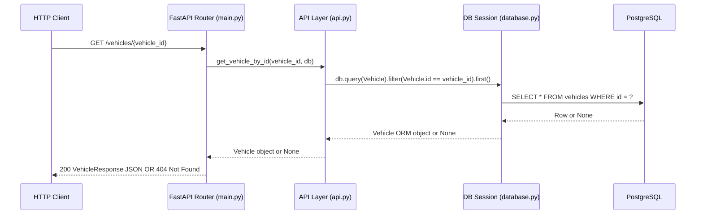

# Architecture — Car Portal: Get Vehicle Details

**Requirements Source:** `artifacts/requirements.md`  
**Generated By:** Agentic SDLC Pipeline — Architect Agent  
**Date:** 2026-09-23  
**Status:** Draft — Pending Review

---

## 1. Architecture Overview

The Car Portal application is a Python FastAPI service. This architecture document covers the minimal scope required to satisfy **FR-001**: retrieving vehicle details by ID from a database.

The design adds a new `GET /vehicles/{vehicle_id}` endpoint backed by a PostgreSQL database accessed through SQLAlchemy ORM. Existing endpoints and functionality are preserved unchanged.

---

## 2. Architectural Goals and Drivers

| Driver | Source |
|--------|--------|
| Retrieve vehicle by ID returning all attributes (make, model, year, price, transmission, fuel_type) | FR-001 / AC-001 |
| Use Python 3.8+, FastAPI, PostgreSQL, SQLAlchemy | `userstory.md` — Technical Stack |
| Keep scope minimal; do not introduce search, CRUD, auth, or NFRs not in the story | Out-of-scope items in `artifacts/requirements.md` |

---

## 3. Recommended Architecture

**Pattern:** Layered monolith — Router → Service/API layer → ORM → Database

The existing app follows a flat 2-layer structure (FastAPI router → JSON-file data access). The new vehicle endpoint follows the same project conventions while introducing SQLAlchemy for the PostgreSQL-backed vehicle data.

### 3.1 Component Diagram

```mermaid
graph TD
    Client["HTTP Client"] -->|GET /vehicles/{vehicle_id}| Router["FastAPI Router\napp/main.py"]
    Router -->|calls| API["API Layer\napp/api/api.py"]
    API -->|query| ORM["SQLAlchemy Session\napp/db/database.py"]
    ORM -->|SQL SELECT| DB[("PostgreSQL\nVehicles Table")]
    API -->|returns| Schema["Pydantic Schema\nVehicleResponse"]
    Router -->|404 if None| Client
```

### 3.2 Key Components and Responsibilities

| Component | File | Responsibility |
|-----------|------|----------------|
| **FastAPI Router** | `app/main.py` | Route definition for `GET /vehicles/{vehicle_id}`; raises HTTP 404 when vehicle not found |
| **API Layer** | `app/api/api.py` | Business logic: call DB session, query Vehicle by primary key, return ORM object or None |
| **Vehicle ORM Model** | `app/db/models.py` | SQLAlchemy `Vehicle` model mapping to the `vehicles` table; columns: id, make, model, year, price, transmission, fuel_type |
| **Database Session** | `app/db/database.py` | SQLAlchemy engine + `SessionLocal` factory; reads `DATABASE_URL` from environment |
| **Pydantic Schema** | `app/db/models.py` | `VehicleResponse` Pydantic model for response serialisation (make, model, year, price, transmission, fuel_type) |
| **PostgreSQL** | External | Persistent storage for vehicle records |

---

## 4. Data Flow



---

## 5. Technology Choices and Rationale

| Technology | Choice | Rationale |
|------------|--------|-----------|
| **Language** | Python 3.8+ | Specified in user story |
| **Web Framework** | FastAPI | Specified in user story; already in use |
| **Database** | PostgreSQL | Specified in user story |
| **ORM** | SQLAlchemy (Core + ORM) | Specified in user story; standard pairing with FastAPI/PostgreSQL |
| **Pydantic** | v1 (already in use) | Already present in `app/db/models.py`; no version change |
| **DB Driver** | `psycopg2` | Standard synchronous PostgreSQL driver for SQLAlchemy |
| **Config** | Environment variable `DATABASE_URL` | Avoids hardcoding credentials; follows twelve-factor app conventions |

---

## 6. New Files and Changes

| Action | Path | Description |
|--------|------|-------------|
| **Create** | `app/db/database.py` | SQLAlchemy engine, `SessionLocal`, `Base`, and `get_db` dependency |
| **Modify** | `app/db/models.py` | Add `Vehicle` SQLAlchemy model + `VehicleResponse` Pydantic schema |
| **Modify** | `app/api/api.py` | Add `get_vehicle_by_id(vehicle_id, db)` function |
| **Modify** | `app/main.py` | Add `GET /vehicles/{vehicle_id}` route with DB session dependency injection |
| **Create** | `test/test_vehicle.py` | Tests for the new endpoint (happy path + 404 case) |

Existing endpoints (`/`, `/user`, `/question`, `/alternatives`, `/answer`, `/result`) are **not modified**.

---

## 7. Security Considerations

| Concern | Approach |
|---------|----------|
| Credentials | `DATABASE_URL` read from environment; never hardcoded or logged |
| SQL Injection | SQLAlchemy ORM parameterised queries prevent injection |
| Input validation | FastAPI path parameter typed as `int`; invalid types rejected at framework level |

---

## 7a. Vehicle Table Schema (DR-005)

| Column | Type | Constraint | Notes |
|--------|------|------------|-------|
| `id` | Integer | PRIMARY KEY | Auto-increment |
| `make` | String(100) | NOT NULL | e.g. "Toyota" |
| `model` | String(100) | NOT NULL | e.g. "Corolla" |
| `year` | Integer | NOT NULL | e.g. 2022 |
| `price` | Numeric(12,2) | NOT NULL | e.g. 24999.99 |
| `transmission` | String(50) | NOT NULL | e.g. "automatic" |
| `fuel_type` | String(50) | NOT NULL | e.g. "petrol" |

**VehicleResponse fields (DR-003):** make, model, year, price, transmission, fuel_type — `id` is excluded from the response per AC-001.

**Test strategy (DR-002, DR-006):** Tests override `get_db` with a SQLite in-memory engine; schema created via `Base.metadata.create_all`; Alembic deferred as out of scope.

---

## 8. Assumptions and Constraints

| # | Assumption / Constraint |
|---|------------------------|
| A1 | The `vehicles` table already exists in PostgreSQL with columns: id (PK), make, model, year, price, transmission, fuel_type. Migrations are out of scope for this story. |
| A2 | `DATABASE_URL` is available as an environment variable at runtime. |
| A3 | The existing synchronous SQLAlchemy pattern (not async) is consistent with the existing codebase style. |
| A4 | The existing `cars.json` data model (id, name, fuel, price, category, link) is separate from the new `vehicles` table and is not migrated. |

---

## 9. Open Questions

| # | Question | Impact if Unresolved |
|---|----------|----------------------|
| OQ-1 | Should the response include the vehicle `id` field, or only the attributes listed in AC-001? | Minor — Pydantic schema field inclusion |
| OQ-2 | Is there an existing database migration tool (Alembic) in use, or should the `vehicles` table be assumed pre-created? | Low — out of scope for this story; test setup will use test fixtures |

---

## 10. Traceability

| Architecture Decision | Traces To |
|----------------------|-----------|
| `GET /vehicles/{vehicle_id}` endpoint | FR-001 |
| Vehicle attributes: make, model, year, price, transmission, fuel_type | AC-001 |
| PostgreSQL + SQLAlchemy | `userstory.md` Technical Stack |
| HTTP 404 on missing vehicle | AC-001 (implicit: valid ID returns data; invalid returns no data) |
