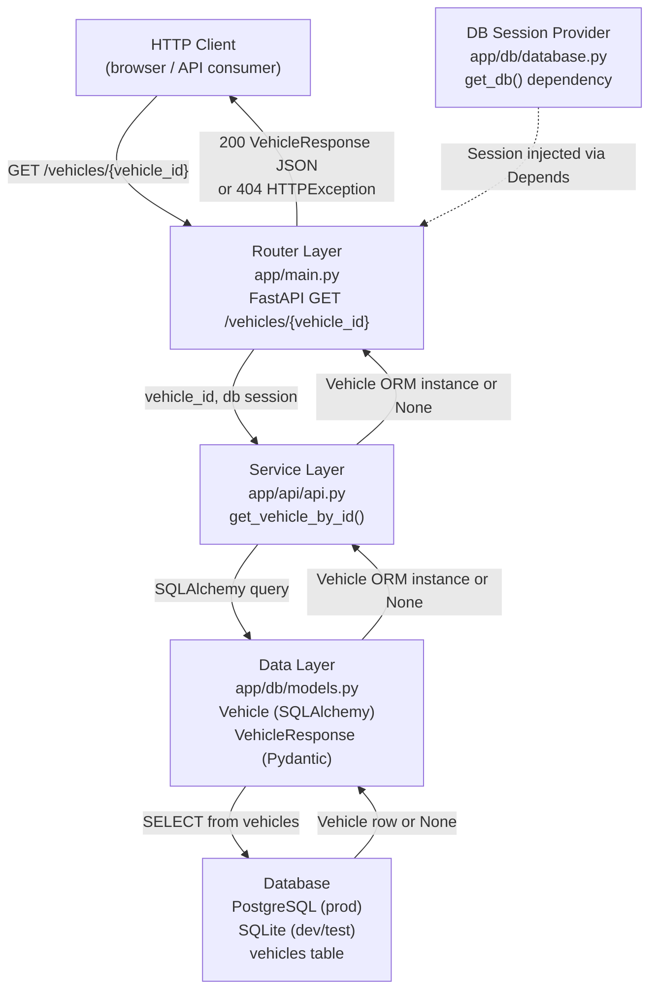
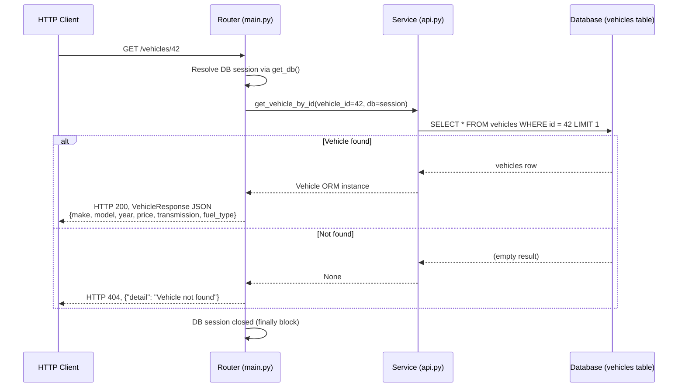

# Architecture — Car Portal: Get Vehicle Details

## Architecture Overview

The Car Portal get-vehicle-details feature is a single REST endpoint implemented as a lightweight **three-layer FastAPI application** backed by a relational database. The layers are:

1. **Router layer** — FastAPI route handler, HTTP error mapping, Pydantic response serialisation
2. **Service layer** — business query functions against the ORM
3. **Data layer** — SQLAlchemy ORM models, Pydantic schemas, database session management

Everything below traces to FR-001: retrieve vehicle details by ID and return all six attributes.

---

## Architectural Goals and Drivers

| Goal | Driver | FR Trace |
|---|---|---|
| Return six vehicle attributes for a given ID | Core user story requirement | FR-001 |
| Return HTTP 404 when the ID does not exist | Correct REST contract, implied by FR-001 | FR-001 |
| Serialise price as a numeric value (float) | API consumers expect a number, not a string | FR-001 (price attribute) |
| Exclude internal `id` from the response | Clean external contract; ID is already a path param | FR-001 (attribute list is exhaustive) |
| Support SQLite in dev/test, PostgreSQL in production | Testability without a running Postgres instance | FR-001 (system must be testable) |

---

## Recommended Architecture

A **layered monolith** is appropriate for this single-endpoint MVP. No microservices, message queues, or caching layers are warranted at this scope. The three layers map directly onto the existing source tree.

```
app/
  main.py          ← Router layer (FastAPI routes + HTTP error mapping)
  api/
    api.py         ← Service layer (ORM query functions)
  db/
    models.py      ← ORM model (Vehicle) + Pydantic schema (VehicleResponse)
    database.py    ← Engine, SessionLocal, get_db dependency provider
```

---

## Component Diagram



---

## Key Components and Responsibilities

### Router Layer — `app/main.py`

| Responsibility | Detail |
|---|---|
| Route definition | `GET /vehicles/{vehicle_id}` with `response_model=VehicleResponse` |
| Dependency injection | Injects a SQLAlchemy `Session` via `Depends(get_db)` |
| 404 handling | Raises `HTTPException(status_code=404)` when service returns `None` |
| Serialisation | FastAPI uses `VehicleResponse` Pydantic model to shape and validate the JSON output |

**Traces to FR-001:** This layer is the entry point for the retrieve-by-ID operation and enforces the HTTP contract.

### Service Layer — `app/api/api.py`

| Responsibility | Detail |
|---|---|
| Query execution | `db.query(Vehicle).filter(Vehicle.id == vehicle_id).first()` |
| Return contract | Returns a `Vehicle` ORM instance, or `None` if not found |
| No business transformation | Raw ORM object passed up; Pydantic handles serialisation at the router |

**Traces to FR-001:** Implements the data retrieval that satisfies the six-attribute lookup.

### Data Layer — `app/db/models.py`

| Class | Role |
|---|---|
| `Vehicle` (SQLAlchemy) | Maps to the `vehicles` table; defines `id`, `make`, `model`, `year`, `price` (Numeric 12,2), `transmission`, `fuel_type` |
| `VehicleResponse` (Pydantic v2) | Outbound schema; exposes `make`, `model`, `year`, `price` (float), `transmission`, `fuel_type` — no `id` |

**Traces to FR-001:** `VehicleResponse` is the authoritative definition of the six required attributes.

### DB Session Provider — `app/db/database.py`

| Responsibility | Detail |
|---|---|
| Engine creation | Reads `DATABASE_URL` env var; defaults to `sqlite:///./carportal.db` |
| Session lifecycle | `get_db()` generator: opens, yields, and closes a session per request |
| Driver compatibility | Sets `check_same_thread=False` for SQLite only |

**Traces to FR-001:** Provides the database connectivity that all reads depend on.

---

## Data Flow — GET /vehicles/{vehicle_id}



---

## Technology Choices and Rationale

| Technology | Version constraint | Rationale |
|---|---|---|
| **FastAPI** | 0.46.0 (pinned) | Specified in user story; provides automatic OpenAPI docs, Pydantic integration, and ASGI request handling |
| **Uvicorn** | 0.11.1 (pinned) | ASGI server compatible with pinned FastAPI version |
| **SQLAlchemy** | >=1.3.0,<2.0.0 | Specified in user story; ORM abstraction allows SQLite/PostgreSQL swap via `DATABASE_URL` |
| **PostgreSQL** | Production target | Specified in user story; psycopg2-binary driver included |
| **SQLite** | Dev/test only | Zero-config alternative enabled by `DATABASE_URL` defaulting to SQLite; test suite uses in-memory SQLite |
| **Pydantic** | v2 (implied by `ConfigDict`) | `VehicleResponse` uses `ConfigDict(from_attributes=True)` — Pydantic v2 syntax |
| **pytest** | 5.3.2 (pinned) | Test framework; `starlette.testclient.TestClient` provides HTTP-level testing without a running server |

**Note on Pydantic version:** `ConfigDict(from_attributes=True)` is Pydantic v2 API, but the pinned FastAPI 0.46.0 was released against Pydantic v1. The Planner Agent must confirm which Pydantic version is installed and whether FastAPI needs an upgrade. This is captured as Risk R-001 below.

---

## Security Considerations

Authentication and authorisation are **explicitly out of scope** per requirements. For this MVP:

- The endpoint is publicly accessible by design.
- No sensitive data beyond vehicle specifications is returned.
- The `id` primary key is intentionally excluded from the response to avoid leaking internal identifiers.

If auth is added in a future iteration it should be applied at the router layer via FastAPI dependency injection (e.g., `Depends(verify_token)`), with no changes required to the service or data layers.

---

## Reliability Considerations

- Database session lifecycle is managed in a `try/finally` block in `get_db()`, ensuring sessions are always closed even on error.
- The 404 path is handled explicitly; no unhandled exceptions should surface for a missing ID.
- The `LIMIT 1` implicit in `.first()` prevents multiple-row anomalies if the primary key constraint were ever violated.

---

## Observability Considerations

FastAPI's built-in Uvicorn access logging provides per-request method, path, status code, and latency at no extra cost. For this MVP that is sufficient. Structured logging or tracing would be a future enhancement.

---

## Deployment Considerations

- The application is environment-agnostic: set `DATABASE_URL` to a PostgreSQL connection string for production; omit it for local development (SQLite fallback).
- There is no migration tooling in scope. The `vehicles` table schema must be created externally (e.g., by running `Base.metadata.create_all(bind=engine)` once, or via a separate migration script).
- The application is stateless; horizontal scaling (multiple Uvicorn workers or containers) is straightforward.

---

## Assumptions

| ID | Assumption |
|---|---|
| A-001 | The `vehicles` table exists and is pre-populated before the application starts. No seeding mechanism is in scope. |
| A-002 | `vehicle_id` is always a positive integer; FastAPI path parameter parsing enforces this. |
| A-003 | The `price` field returning as `float` (Python) rather than `Decimal` is acceptable for display consumers. |
| A-004 | A single Uvicorn worker process is sufficient for MVP deployment. |

---

## Constraints

| ID | Constraint |
|---|---|
| C-001 | Technology stack (FastAPI, SQLAlchemy, PostgreSQL, Python 3.8+) is fixed by the user story. |
| C-002 | Only the GET by ID operation is in scope — no list, create, update, or delete. |
| C-003 | No authentication or authorisation. |
| C-004 | No non-functional requirements (performance targets, SLAs) have been specified. |

---

## Risks

| ID | Risk | Likelihood | Impact | Mitigation |
|---|---|---|---|---|
| R-001 | FastAPI 0.46.0 was built for Pydantic v1; `ConfigDict(from_attributes=True)` is Pydantic v2 syntax. If both are installed at their respective pinned versions the app will fail at startup. | High | High | Planner Agent must check installed Pydantic version and either (a) upgrade FastAPI to a version that supports Pydantic v2, or (b) replace `ConfigDict` with `class Config: orm_mode = True` for Pydantic v1 compatibility. |
| R-002 | SQLAlchemy `<2.0.0` constraint combined with Pydantic v2 and a newer Python environment may produce deprecation warnings or subtle compatibility issues. | Medium | Low | Run `pytest` before delivery to confirm no import-time errors. |
| R-003 | No database migration tooling means schema drift is possible if the `vehicles` table definition changes. | Low | Medium | Out of scope for this MVP; document as a future concern. |

---

## Open Questions

| ID | Question | Owner |
|---|---|---|
| OQ-001 | Which Pydantic version is installed in the project's virtual environment? Resolution determines whether R-001 is already present or not. | Planner / Implementation Agent |
| OQ-002 | Is there an Alembic migration or a seeding script for the `vehicles` table, or must it be created manually? | Planner Agent |
| OQ-003 | Should the `id` field ever be exposed (e.g., for client-side navigation)? Current design omits it. | Product / Requirements Agent |

---

## Requirement Traceability

| Architecture Element | FR-001 |
|---|---|
| `GET /vehicles/{vehicle_id}` route | Direct |
| `get_vehicle_by_id()` service function | Direct |
| `Vehicle` ORM model (six columns) | Direct |
| `VehicleResponse` Pydantic schema (six fields) | Direct |
| `get_db()` session provider | Indirect (enables DB access) |
| HTTP 404 on missing ID | Direct (implied by "retrieve by ID" — invalid ID must not return garbage) |
