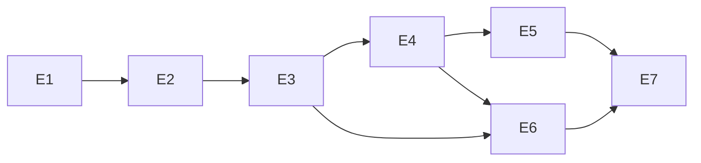

# Implementation Plan — Customer Login for Ecommerce Application

- **Story ID:** US-LOGIN-001
- **Upstream artifacts:** [requirements.md](requirements.md),
  [architecture.md](architecture.md), [design-review.md](design-review.md)
- **Status:** Proposed (pending approval — Step 4)
- **Target implementer:** Implementation Agent (`/05-implementation`)

## 1. Epics

| Epic | Goal | Primary requirements |
| --- | --- | --- |
| **E1 — Foundation & Environment** | Repo scaffolding, tooling, Docker/K8s, secrets, CI. | NFR-001, NFR-008, NFR-011 |
| **E2 — Data & Persistence** | PostgreSQL schema, Redis, migrations, repositories. | FR-014, FR-016, NFR-006, NFR-009 |
| **E3 — Auth Core (Security)** | Hashing, tokens, lockout, CSRF, verification middleware. | FR-004, FR-012, FR-013, NFR-004–NFR-008 |
| **E4 — Auth API** | REST endpoints: login, refresh, logout, protected-route guard. | FR-003, FR-005, FR-006, FR-014, FR-015 |
| **E5 — Frontend SPA** | Login UI, validation, masking, redirect, silent refresh, a11y. | FR-001, FR-002, FR-005, FR-007–FR-012, FR-015, NFR-002, NFR-010, NFR-012 |
| **E6 — Observability & Ops** | Audit logging, metrics, health probes, alerts. | FR-016, NFR-011, NFR-013 |
| **E7 — Verification** | Unit, integration, security, a11y, and perf tests. | All FR/NFR |

## 2. Dependency Order (high level)

Foundational work (environment, data model, security primitives, API contracts)
precedes dependent work (endpoints, then UI, then cross-cutting ops, then the
verification suite).

## 3. Task Breakdown

Legend — **Priority:** P0 (critical path) · P1 (high) · P2 (normal).
Every task cites the `FR`/`NFR` and architecture section it implements.

### E1 — Foundation & Environment

| Field | Value |
| --- | --- |
| **TASK-001** | Monorepo scaffolding (frontend + backend) with TypeScript, lint, format, test runners |
| Status | ✅ Done (build/lint/test green) |
| Priority | P0 |
| Depends-on | — |
| Blocked-by | — |
| Target agent | Implementation Agent |
| Description | Create `frontend/` (React+TS) and `backend/` (Node+TS) packages, shared tsconfig/eslint/prettier, test tooling (Vitest), `.env.example`. |
| Expected output | Buildable, lintable skeleton repo with passing empty test run. |
| Validation | `build`, `lint`, and `test` scripts succeed in CI. |
| Traces to | Arch §1; NFR-001 |

| Field | Value |
| --- | --- |
| **TASK-002** | Containerization & local orchestration |
| Priority | P1 |
| Depends-on | TASK-001 |
| Blocked-by | — |
| Target agent | Implementation Agent |
| Description | Dockerfiles for frontend/backend; `docker-compose` for local Postgres + Redis; K8s manifests (Deployment, Service, Ingress with TLS) as templates. |
| Expected output | `docker-compose up` runs API, SPA, Postgres, Redis locally. |
| Validation | Containers start; health endpoint reachable over the compose network. |
| Traces to | Arch §1, §8 (AD-5, AD-6); NFR-003, NFR-011 |

| Field | Value |
| --- | --- |
| **TASK-003** | Secrets management & config |
| Status | ✅ Done (build/lint/test green) |
| Priority | P0 |
| Depends-on | TASK-001 |
| Blocked-by | — |
| Target agent | Implementation Agent |
| Description | Config loader that reads JWT signing keys (with `kid`), DB/Redis credentials from a secrets provider (Vault/cloud KMS abstraction); no secrets in source; support key rotation. |
| Expected output | Typed config module; secrets injected via env/secret store; rotation-ready key registry. |
| Validation | Unit test asserts no hard-coded secrets; rotation swaps active `kid`. |
| Traces to | Arch §8 (AD-13, DR-008); NFR-008 |

### E2 — Data & Persistence

| Field | Value |
| --- | --- |
| **TASK-004** | Database schema & migrations |
| Status | ✅ Done (schema unit tests green; live migrate pending Postgres via TASK-002) |
| Priority | P0 |
| Depends-on | TASK-001 |
| Blocked-by | — |
| Target agent | Implementation Agent |
| Description | Migrations for `users`, `refresh_tokens` (incl. `family_id`, `remember_me`, `expires_at`, `revoked`), `audit_log`, and `attempt_fallback` per Arch §5. |
| Expected output | Versioned migrations + schema applied to local Postgres. |
| Validation | Migration up/down runs cleanly; schema matches Arch §5 ER model. |
| Traces to | Arch §5; FR-014, FR-016, NFR-009 |

| Field | Value |
| --- | --- |
| **TASK-005** | Redis integration for lockout/rate-limit state |
| Priority | P0 |
| Depends-on | TASK-002, TASK-004 |
| Blocked-by | — |
| Target agent | Implementation Agent |
| Description | Redis client wrapper with atomic INCR + TTL for per-account and per-IP counters; DB `attempt_fallback` path when Redis is unavailable (fail-open). |
| Expected output | Reusable counter service with Redis-primary/DB-fallback behavior. |
| Validation | Unit tests for increment/expiry/reset and Redis-down fallback. |
| Traces to | Arch §5, §8 (AD-8, DD-2); FR-013, NFR-006, NFR-011 |

| Field | Value |
| --- | --- |
| **TASK-006** | Data repositories |
| Priority | P1 |
| Depends-on | TASK-004 |
| Blocked-by | — |
| Target agent | Implementation Agent |
| Description | Parameterized repository layer for users, refresh tokens, and audit log (no string-built SQL — OWASP A03). |
| Expected output | User/RefreshToken/AuditLog repositories with typed methods. |
| Validation | Unit tests with a test DB; SQL is parameterized. |
| Traces to | Arch §4, §7; FR-014, FR-016, NFR-008 |

### E3 — Auth Core (Security)

| Field | Value |
| --- | --- |
| **TASK-007** | API contract definition (OpenAPI) |
| Priority | P0 |
| Depends-on | TASK-001 |
| Blocked-by | — |
| Target agent | Implementation Agent |
| Description | OpenAPI spec for `/auth/login`, `/auth/refresh`, `/auth/logout`, and a sample protected route; define request/response shapes, status codes (200/401/429), cookie + CSRF semantics. |
| Expected output | `openapi.yaml` shared by frontend and backend. |
| Validation | Spec lints; used to generate/validate types. |
| Traces to | Arch §3, §6; FR-003, FR-006 |

| Field | Value |
| --- | --- |
| **TASK-008** | Password hashing & identifier normalization |
| Priority | P0 |
| Depends-on | TASK-006 |
| Blocked-by | — |
| Target agent | Implementation Agent |
| Description | argon2id hashing/verify with bounded input length; identifier normalizer (email lowercase, mobile → E.164); uniform-timing verify to prevent enumeration. |
| Expected output | `PasswordHasher` + `IdentifierNormalizer` utilities. |
| Validation | Unit tests: hash/verify, length bounds, normalization cases, timing parity. |
| Traces to | Arch §4, §7 (DR-007, DR-010); NFR-004, NFR-005 |

| Field | Value |
| --- | --- |
| **TASK-009** | Token service (JWT issue/rotate + reuse detection) |
| Priority | P0 |
| Depends-on | TASK-003, TASK-006 |
| Blocked-by | — |
| Target agent | Implementation Agent |
| Description | Issue access JWT (15m) signed with rotating `kid`; issue refresh token — 30d rotating if rememberMe else ~1d session; rotation with reuse detection revoking the whole `family_id`. |
| Expected output | `TokenService` with issue/verify/rotate/revokeFamily. |
| Validation | Unit tests: lifetimes by rememberMe, rotation, reuse→family revocation. |
| Traces to | Arch §4, §8 (AD-9, AD-11, DD-3, DD-5); FR-004, FR-012, NFR-007 |

| Field | Value |
| --- | --- |
| **TASK-010** | Lockout manager (per-account + per-IP) |
| Priority | P0 |
| Depends-on | TASK-005 |
| Blocked-by | — |
| Target agent | Implementation Agent |
| Description | 5-attempt / 15-min lockout keyed by normalized account and by IP; returns lock state without leaking account existence. |
| Expected output | `LockoutManager` used by the login flow. |
| Validation | Unit tests: threshold, window expiry, per-IP lock, reset on success. |
| Traces to | Arch §4, §8 (AD-7, DD-1); FR-013, NFR-005, NFR-006 |

| Field | Value |
| --- | --- |
| **TASK-011** | CSRF protection & access-token verification middleware |
| Priority | P0 |
| Depends-on | TASK-009 |
| Blocked-by | — |
| Target agent | Implementation Agent |
| Description | Double-submit CSRF token issuance/validation for cookie endpoints; JWT verification middleware (signature/exp/`kid`) guarding protected routes; security headers + CSP. |
| Expected output | `csrfGuard` + `requireAuth` middleware. |
| Validation | Unit tests: CSRF accept/reject, expired/invalid token rejection. |
| Traces to | Arch §4, §7, §8 (AD-10, AD-12, DD-4, DR-002); NFR-007, NFR-008 |

### E4 — Auth API

| Field | Value |
| --- | --- |
| **TASK-012** | Login endpoint `POST /auth/login` |
| Priority | P0 |
| Depends-on | TASK-008, TASK-009, TASK-010, TASK-006 |
| Blocked-by | — |
| Target agent | Implementation Agent |
| Description | Orchestrate lockout check → normalize → lookup → verify → issue tokens; generic 401 on invalid/locked; set refresh cookie (httpOnly, Secure, SameSite=Strict) + CSRF token; compute redirect target. |
| Expected output | Working login endpoint per OpenAPI. |
| Validation | Integration tests for AC-02, AC-03, AC-08 (locked→generic 401). |
| Traces to | Arch §3, §4; FR-002–FR-006, FR-013, FR-014, NFR-005 |

| Field | Value |
| --- | --- |
| **TASK-013** | Refresh & logout endpoints |
| Priority | P0 |
| Depends-on | TASK-011, TASK-012 |
| Blocked-by | — |
| Target agent | Implementation Agent |
| Description | `POST /auth/refresh` (rotate + reuse detection, CSRF-guarded); `POST /auth/logout` (revoke token family, clear cookie). |
| Expected output | Refresh/logout endpoints per OpenAPI. |
| Validation | Integration tests: rotation, reuse→family revoke, logout revocation. |
| Traces to | Arch §3, §4; FR-015, NFR-007 |

| Field | Value |
| --- | --- |
| **TASK-014** | Rate limiting at gateway/app edge |
| Priority | P1 |
| Depends-on | TASK-005 |
| Blocked-by | — |
| Target agent | Implementation Agent |
| Description | Per-IP rate limiting on auth endpoints (429 on breach) complementing per-account lockout. |
| Expected output | Rate-limit middleware/gateway config. |
| Validation | Integration test returns 429 beyond threshold. |
| Traces to | Arch §2, §8 (AD-6); NFR-006 |

### E5 — Frontend SPA

| Field | Value |
| --- | --- |
| **TASK-015** | Login form UI + password masking |
| Priority | P0 |
| Depends-on | TASK-001, TASK-007 |
| Blocked-by | — |
| Target agent | Implementation Agent |
| Description | Login page with single identifier field, password field masked with show/hide toggle, Remember Me checkbox, Forgot-Password and Register links. |
| Expected output | Rendered, styled login form component. |
| Validation | Component tests for AC-01, AC-05; links present (AC-06). |
| Traces to | Arch §4; FR-001, FR-002, FR-009, FR-010, FR-011, FR-012 |

| Field | Value |
| --- | --- |
| **TASK-016** | Client validation & error handling |
| Priority | P0 |
| Depends-on | TASK-015 |
| Blocked-by | — |
| Target agent | Implementation Agent |
| Description | Required-field messages ("… is required"), render generic server error, inline messaging near fields. |
| Expected output | Validation + error UI wired to the form. |
| Validation | Component tests for AC-04, AC-03 (generic error shown). |
| Traces to | Arch §4; FR-006, FR-007, FR-008, NFR-012 |

| Field | Value |
| --- | --- |
| **TASK-017** | Auth client, session state, silent refresh & redirect |
| Priority | P0 |
| Depends-on | TASK-012, TASK-013, TASK-016 |
| Blocked-by | — |
| Target agent | Implementation Agent |
| Description | Call auth API; keep access token in memory; silent refresh on app load via cookie; global authenticated state; post-login redirect to prior checkout/cart or home. |
| Expected output | Auth context/hooks + protected-route wiring. |
| Validation | Tests for AC-02 (redirect), AC-07 (Remember Me), AC-09 (persisted state). |
| Traces to | Arch §3, §8 (DR-009); FR-005, FR-012, FR-015, NFR-007 |

| Field | Value |
| --- | --- |
| **TASK-018** | Accessibility (WCAG 2.1 AA) |
| Priority | P1 |
| Depends-on | TASK-016 |
| Blocked-by | — |
| Target agent | Implementation Agent |
| Description | Labels, focus order, contrast, keyboard operability, ARIA live regions announcing validation/auth errors. |
| Expected output | a11y-compliant login page. |
| Validation | Automated a11y scan (axe) + manual keyboard/SR check → AC-11. |
| Traces to | Arch §7; NFR-010, NFR-012 |

### E6 — Observability & Ops

| Field | Value |
| --- | --- |
| **TASK-019** | Audit logging |
| Priority | P0 |
| Depends-on | TASK-006 |
| Blocked-by | — |
| Target agent | Implementation Agent |
| Description | Record every login attempt (success/invalid/locked) with masked identifier, source IP, outcome, timestamp; never log secrets. |
| Expected output | Audit logger integrated into the login/refresh/logout flows. |
| Validation | Tests: entries written per outcome; no password/token in logs → AC-10. |
| Traces to | Arch §4; FR-016, NFR-009, NFR-013 |

| Field | Value |
| --- | --- |
| **TASK-020** | Metrics, health probes & alerts |
| Priority | P1 |
| Depends-on | TASK-012 |
| Blocked-by | — |
| Target agent | Implementation Agent |
| Description | Readiness/liveness endpoints; metrics for login success/failure/lockout; alert rules for failed-login/lockout spikes. |
| Expected output | `/healthz`, `/readyz`, metrics endpoint, alert config. |
| Validation | Probes return correctly; metrics increment; alert rule validates. |
| Traces to | Arch §7 (DR-011); NFR-011, NFR-013 |

### E7 — Verification

| Field | Value |
| --- | --- |
| **TASK-021** | Automated test suite (unit + integration) |
| Priority | P0 |
| Depends-on | TASK-012, TASK-013, TASK-017, TASK-019 |
| Blocked-by | — |
| Target agent | Implementation Agent / Verify Agent |
| Description | Complete unit + integration coverage mapping each AC-01…AC-12 to tests; CI gate. |
| Expected output | Green test suite in CI with traceability comments citing FR/NFR. |
| Validation | All acceptance-criteria tests pass; coverage threshold met. |
| Traces to | All FR/NFR; §11 acceptance criteria |

| Field | Value |
| --- | --- |
| **TASK-022** | Security & performance validation |
| Priority | P1 |
| Depends-on | TASK-013, TASK-014 |
| Blocked-by | — |
| Target agent | Verify Agent |
| Description | OWASP-focused checks (enumeration, CSRF, headers, injection), and load test for auth API p95 < 500ms / page < 2s. |
| Expected output | Security + performance test report. |
| Validation | Meets AC-12; no High/Critical security findings. |
| Traces to | Arch §7; NFR-001, NFR-002, NFR-003, NFR-005–NFR-008 |

## 4. Blocked Tasks

| Task | Blocked-by | Unblock criteria |
| --- | --- | --- |
| **TASK-023** — Mobile-number validation ruleset | OQ-02 (E.164 / regional format) | Stakeholder confirms the accepted mobile-number format/region standard. Until then TASK-008 uses a permissive E.164 default flagged for review. |
| **TASK-024** — Audit-log retention & partitioning | OQ-03 (retention period) | Security/ops defines retention duration; then implement partitioning/archival for `audit_log`. |
| **TASK-025** — Account-owner alert on repeated failures | OQ-05 (notify on lockout?) | Product confirms whether lockout triggers an owner notification; if yes, adds an email/notification integration. |

These are **not** on the critical path; core login (TASK-001…TASK-022) can ship
without them. They are tracked against the open questions in
[requirements.md](requirements.md) §14.

## 5. Parallelization Guidance

- After **TASK-001**: TASK-003 (secrets), TASK-004 (schema), and TASK-007
  (OpenAPI) can proceed in parallel.
- Within E3: TASK-008, TASK-009, TASK-010 are largely independent once their
  data deps exist and can be built in parallel.
- E5 (frontend) can start against the OpenAPI contract (TASK-007) in parallel
  with E3/E4 backend work; integrate at TASK-017.
- E6 tasks (TASK-019, TASK-020) can proceed alongside E4 once repositories exist.

## 6. Critical Path

TASK-001 → TASK-004 → TASK-008/009/010 → TASK-011 → TASK-012 → TASK-013 →
TASK-017 → TASK-021. Foundation, data model, and security primitives are the
gating dependencies for the API, which gates the SPA integration and the
verification suite.

---

### Traceability

Every `TASK-###` cites the `FR`/`NFR` and the `architecture.md` section (and
DR/DD decision where relevant) it implements. Blocked tasks map to the open
questions (OQ-02, OQ-03, OQ-05) that gate them, per the `sdlc-traceability`
skill.

**Next step:** hand off to `/05-implementation` (Implementation Agent).
